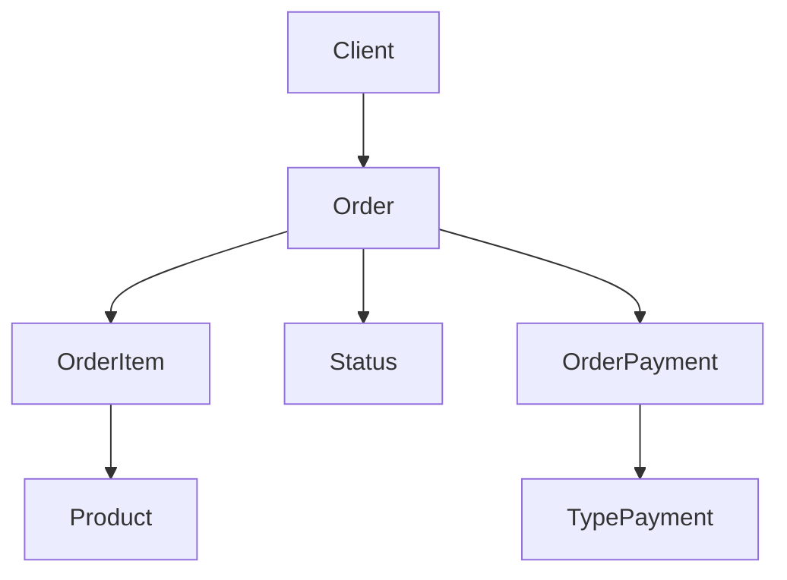

# E-commerce API - Arquitetura de Sistemas

API REST completa para um sistema de e-commerce com padrão de soft delete e relacionamentos complexos.

## Arquitetura Implementada

A API segue a arquitetura apresentada no diagrama com as seguintes entidades:

### Entidades Principais:
- **Products** - Produtos do catálogo (com soft delete)
- **Clients** - Clientes do sistema (com soft delete) 
- **Orders** - Pedidos realizados pelos clientes (com soft delete)
- **OrderItems** - Items específicos de cada pedido
- **Status** - Status dos pedidos (Pendente, Processando, etc.)
- **TypePayment** - Tipos de pagamento disponíveis
- **OrderPayment** - Pagamentos realizados para cada pedido

## Endpoints Disponíveis

### Produtos (`/products`)
- `GET /products` - Listar todos os produtos (não deletados)
- `GET /products/:id` - Obter produto específico
- `POST /products` - Criar novo produto
- `PUT /products/:id` - Atualizar produto
- `DELETE /products/:id` - Deletar produto (soft delete)

### Clientes (`/clients`)
- `GET /clients` - Listar todos os clientes (não deletados)
- `GET /clients/:id` - Obter cliente específico
- `GET /clients/:id/orders` - **NOVO!** Obter pedidos de um cliente específico
- `POST /clients` - Criar novo cliente
- `PUT /clients/:id` - Atualizar cliente
- `DELETE /clients/:id` - Deletar cliente (soft delete)

### Pedidos (`/orders`)
- `GET /orders` - Listar todos os pedidos (com cliente, status e itens)
- `GET /orders/:id` - Obter pedido específico
- `POST /orders` - Criar novo pedido (requer clientId)

### Sistema
- `GET /status` - Listar status disponíveis
- `POST /status` - Criar novo status
- `GET /payment-types` - Listar tipos de pagamento
- `POST /payment-types` - Criar novo tipo de pagamento

### Saúde
- `GET /health` - Status da aplicação
- `GET /test-db` - Testar conexão com banco

## Como Executar

### 1. Iniciar o ambiente Docker:
```bash
docker-compose up -d
```

### 2. Instalar dependências:
```bash
cd Api_Ecommerce
npm install
```

### 3. Executar migrações do banco:
```bash
npx prisma migrate dev
```

### 4. Gerar cliente Prisma:
```bash
npx prisma generate
```

### 5. Executar seed (dados iniciais):
```bash
npm run prisma:seed
```

### 6. Iniciar a aplicação:
```bash
npm start
```

A API estará disponível em: `http://localhost:3000`

## Dados Iniciais (Seed)

O script de seed cria automaticamente:

### Status de Pedidos:
- Pendente
- Processando  
- Enviado
- Entregue
- Cancelado

### Tipos de Pagamento:
- Cartão de Crédito
- Cartão de Débito
- PIX
- Boleto

### Clientes de Exemplo:
- João Silva (joao.silva@email.com)
- Maria Santos (maria.santos@email.com)

### Produtos de Exemplo:
- Smartphone Samsung Galaxy S24 (R$ 1.399,99)
- iPhone 15 Pro (R$ 6.999,99)
- MacBook Pro M3 (R$ 12.999,99)

## Testando a API

Use o arquivo `testes-api.http` com a extensão REST Client do VS Code para testar todos os endpoints.

### Fluxo de Teste Recomendado:
1. Criar produtos (`POST /products`)
2. Criar clientes (`POST /clients`)
3. Criar pedidos (`POST /orders`) vinculando cliente e produtos
4. Consultar pedidos de cliente específico (`GET /clients/:id/orders`)
5. Verificar status e tipos de pagamento

### Exemplos de Uso:

#### Criar Cliente:
```http
POST http://localhost:3000/clients
Content-Type: application/json

{
  "name": "João Silva",
  "email": "joao.silva@email.com",
  "phone": "11999999999"
}
```

#### Criar Pedido:
```http
POST http://localhost:3000/orders
Content-Type: application/json

{
  "clientId": "client-uuid-here",
  "items": [
    {
      "productId": "product-uuid-here",
      "quantity": 2
    }
  ]
}
```

#### Consultar Pedidos de um Cliente:
```http
GET http://localhost:3000/clients/client-uuid-here/orders
```

## Validações Implementadas

### Produtos:
- Nome obrigatório (string não vazia)
- Preço obrigatório (número positivo)
- Estoque obrigatório (inteiro não negativo)
- Soft delete (preserva histórico)

### Clientes:
- Nome obrigatório (string não vazia)
- Email obrigatório (formato válido)
- Email único no sistema
- Telefone opcional
- Soft delete (preserva relacionamentos)

### Pedidos:
- Cliente obrigatório (deve existir e não estar deletado)
- Pelo menos 1 item obrigatório
- Validação de estoque automática
- Cálculo automático de subtotais e total
- Status padrão "Pendente" 
- Não permite pedidos com produtos deletados
- Preserva histórico mesmo com produtos deletados

## Recursos de Segurança e Integridade

### Soft Delete:
- **Produtos**: Removidos logicamente, preservam histórico de pedidos
- **Clientes**: Removidos logicamente, mantêm relacionamentos existentes
- **Pedidos**: Removidos logicamente para auditoria

### Validações de Negócio:
- Impede criação de pedidos com produtos deletados
- Impede criação de pedidos para clientes deletados
- Valida estoque antes de criar pedidos
- Recalcula totais automaticamente
- Mantém integridade referencial

## Relacionamentos



### Relacionamentos Detalhados:
- **Order** ↔ **Client** (Many-to-One) - Cada pedido pertence a um cliente
- **Order** ↔ **Status** (Many-to-One) - Cada pedido tem um status
- **Order** ↔ **OrderItem** (One-to-Many) - Pedido pode ter múltiplos itens
- **Order** ↔ **OrderPayment** (One-to-Many) - Pedido pode ter múltiplos pagamentos
- **OrderItem** ↔ **Product** (Many-to-One) - Item referencia um produto
- **OrderPayment** ↔ **TypePayment** (Many-to-One) - Pagamento tem um tipo

## Tecnologias

### Backend:
- **Node.js** - Runtime JavaScript
- **Express.js** - Framework web minimalista
- **Prisma ORM** - Object-Relational Mapping moderno

### Banco de Dados:
- **PostgreSQL** - Banco relacional robusto
- **Docker** - Containerização do ambiente
- **Docker Compose** - Orquestração de containers

### Ferramentas de Desenvolvimento:
- **VS Code REST Client** - Testes de API
- **Prisma Studio** - Interface visual do banco
- **pgAdmin** - Administração PostgreSQL

## Estrutura do Projeto

```
Api_Ecommerce/
├── controllers/          # Controladores das rotas
│   ├── clientsControllers.js
│   ├── ordersControllers.js
│   ├── productsControllers.js
│   └── systemControllers.js
├── services/             # Lógica de negócio
│   ├── clientsServices.js
│   ├── ordersServices.js
│   └── productsServices.js
├── repositories/         # Acesso aos dados (legado)
├── routes/               # Definição das rotas
│   ├── clientsRoutes.js
│   ├── ordersRoutes.js
│   └── productsRoutes.js
├── prisma/              # Configuração do banco
│   ├── schema.prisma       # Schema do banco
│   ├── seed.js            # Dados iniciais
│   └── migrations/     # Histórico de mudanças
├── utils/               # Utilitários
│   ├── errors.js          # Tratamento de erros
│   └── validators.js      # Validações
├── Dockerfile          # Imagem Docker da API
├── package.json        # Dependências do projeto
├── server.js          # Arquivo principal
└── testes-api.http    # Testes da API
```

## Features Implementadas

### CRUD Completo:
- [x] Produtos com soft delete
- [x] Clientes com soft delete  
- [x] Pedidos com validações
- [x] Status de pedidos
- [x] Tipos de pagamento

### Funcionalidades Avançadas:
- [x] Soft delete em todas as entidades principais
- [x] Validação de estoque automática
- [x] Cálculo automático de totais
- [x] Relacionamentos complexos preservados
- [x] Endpoint específico para pedidos de cliente
- [x] Tratamento de erros centralizado
- [x] Validações de entrada robustas

### Infraestrutura:
- [x] Docker e Docker Compose
- [x] Migrações automáticas do banco
- [x] Seed de dados iniciais
- [x] Testes automatizados via REST Client
- [x] Documentação completa

---

## **API Pronta para Produção!**

Esta API implementa todas as funcionalidades essenciais de um e-commerce moderno com padrões de desenvolvimento profissionais, soft delete para preservação de dados históricos e relacionamentos complexos bem estruturados.

